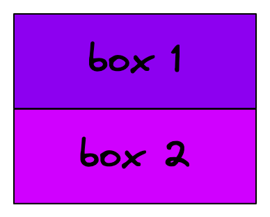
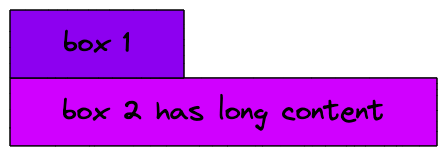
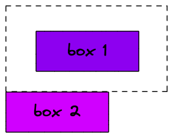
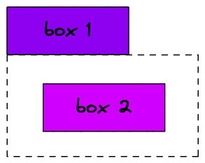

<style>
    header {
        font-size: 16px;
        font-weight: bold;
        color: #4a00e0;
    }

    footer {
        font-size: 16px;
    }

    h1, h2, h3 {
        color: #4a00e0;
    }

    h1>strong, h2>strong, h3>strong, h4>strong {
        color: #D000FF;
    }

    a {
        color: #D000FF;
    }

    section.twoColumnImage p {
        display: flex;
        justify-content: space-around;
    }

    section.titlePage footer {
        background-color: rgb(255, 255, 255, 0.8);
        color: #000;
        padding: 8px 18px;
        border-radius: 0 4px 4px 0;
        font-size: 20px;
        left: 0;
        box-shadow: 0 2px 5px 2px rgb(0, 0, 0, .4);
    }

    section.titlePage {
        color: white;
        background-image: linear-gradient(to right, #4a00e0, #D000FF );
    }

    section.titlePage h1, section.titlePage h2 {
        color: white
    }
</style>


<!--  SECTION 1: INTRO  -------------------------------->

<!-- _header: "" -->
<!-- _footer: "**Allie Polubiec**\nemail: alexandra.polubiec@gmail.com\nslides: [github.com/paloobi/intro-to-css]([github.com/paloobi](https://www.github.com/paloobi))" -->
<!-- _class: titlePage -->

# Intro to CSS

---

# What We'll Cover

* What is CSS?
* Understanding the CSS Box Model
* Basic CSS syntax
* The CSS Cascade
* After Lecture: Intro to CSS Lab

---

# How CSS Fits into the Web

<!-- JavaScript = Programming Language = Procedures & Logic, Instructions-->
* ### **JavaScript** - Programming Language

<!-- HTML = Markup Language = Content & Structure, Relationships -->
* ### **HTML** - Markup Language

<!-- CSS = Style Sheet Language = Presentation -->
* ### **CSS** - Style Sheet language

---

<!--  SECTION 2: WHAT IS CSS  -------------------------------->

<!-- _class: titlePage -->
<!-- _header: "" -->
<!-- _footer: "" -->

# What is CSS?

---

<!-- _header: Intro to CSS > What is CSS? -->

## Cascading Style Sheets

---

<!-- _header: Intro to CSS > What is CSS? -->

## **Cascading** Style Sheets
<!-- CASCADING - we'll come back to this -->

---

<!-- _header: Intro to CSS > What is CSS? -->

## Cascading **Style Sheets**
<!-- Style Sheet = (like in print media) List of Styles to be applied to structured content -->

---
<!-- _header: "" -->
<!-- _footer: "" -->


<!-- XKCD comic -->

---
<!-- _header: "" -->
<!-- _footer: "" -->


<!-- XKCD comic without CSS -->

---

<!--  SECTION 3: BOX MODEL  -------------------------------->

<!-- _class: titlePage -->
<!-- _header: "" -->
<!-- _footer: "" -->

# The Box Model

---
<!-- _header: Intro to CSS > Box Model -->
<!-- _footer: "source: http://info.cern.ch/hypertext/WWW/MarkUp/Connolly/MarkUp.html" -->


---
<!-- _header: Intro to CSS > Box Model -->
<!-- _footer: "source: http://info.cern.ch/hypertext/WWW/MarkUp/Connolly/MarkUp.html" -->

<!-- Every HTML Element in CSS has an invisible box around it. -->


---
<!-- _header: Intro to CSS > Box Model -->
<!-- _class: textRight -->

<style>
    section.textRight ul {
        position: absolute;
        left: 60%;
        top: 300px;
    }
</style>

<!-- CONTENT = the dynamic content, such as the text in a paragraph, or the label on a button -->
<!-- PADDING = space between the content and its border; space inside -->
<!-- BORDER = border around the outside of the object -->
<!-- MARGIN = space around / between -->
# The Box Model


* Content
* Padding
* Border
* Margin

---
<!-- _header: Intro to CSS > Box Model -->
<!-- _class: twoColumnImage -->

# Example



---
<!-- _header: Intro to CSS > Box Model -->
<!-- _class: twoColumnImage -->

# Content




---
<!-- _header: Intro to CSS > Box Model -->
<!-- _class: twoColumnImage -->

# Padding


---
<!-- _header: Intro to CSS > Box Model -->
<!-- _class: twoColumnImage -->

# Border


---
<!-- _header: Intro to CSS > Box Model -->
<!-- _class: twoColumnImage -->

# Margin




---
<!-- _header: Intro to CSS > Box Model -->

<!-- ANY QUESTIONS? -->


---

<!--  SECTION 4: WRITING CSS  -------------------------------->

<!-- _class: titlePage -->
<!-- _header: "" -->
<!-- _footer: "" -->

# Writing CSS

---
<!-- _header: Intro to CSS > Writing CSS -->

# Writing CSS > Rules
**CSS Rule** = defines how a box (and its contents) should be presented

---
<!-- _header: Intro to CSS > Writing CSS > Rules -->

# Anatomy of a CSS Rule

<!-- CSS Rule - made of selector + declaration -->

```css
p { /* <---- SELECTOR */
    color: blue; /* <----- DECLARATION */
}
```

- **Selector**: which elements to apply styles to
* **Declaration**:
    * **property**: what style to change
    * **value**: what to set the property to

---

<!-- _header: Intro to CSS > Writing CSS > Rules -->

# Anatomy of a CSS Rule

<!-- CSS Rule - made of selector + declaration -->

```css
h1, h2 { /* <---- SELECTOR */
    color: purple; /* <------- DECLARATION */
    font-weight: bold; /* <--- DECLARATION */
}
```

* **Multiple Selectors**: comma separated
* **Multiple Declarations**: semi-colon separated

---
<!-- _header: Intro to CSS > Writing CSS > Selectors -->

# Writing CSS > Selectors

---

<!-- _header: Intro to CSS > Writing CSS > Selectors -->

## Common Selectors

* **Type** selectors - `p`, `h1`, `div`, `span`
* **Class** selectors - `.myClass`
* **ID** selectors - `#myID`

---
<!-- _header: Intro to CSS > Writing CSS > Selectors -->
<!-- _class: typeSelectors -->

<style>
    section.typeSelectors h2 {
        background-color: purple;
        color: white;
    }
</style>

## Type Selectors

Select subjects by HTML element type.

### CSS
```css
h2 {
    background-color: purple;
    color: white;
}
```
### HTML
```html
<h2>Type Selectors</h2>
```

---
<!-- _header: Intro to CSS > Writing CSS > Selectors -->
<!-- _class: classSelectors -->
<style>
    section.classSelectors h2 {
        background-color: green;
        color: white;
    }
</style>

## Class Selectors

Select subjects by their `class` attribute.

### CSS
```css
.greenText {
    background-color: green;
    color: white;
}
```

### HTML
```html
<h2 class="greenText">Class Selectors</h2>
```

---
<!-- _header: Intro to CSS > Writing CSS > Selectors -->
<!-- _class: idSelectors -->

<style>
    section.idSelectors h2 {
        background-color: darkblue;
        color: white;
    }
</style>

## ID Selectors

Select subject by its `id` attribute.

### CSS
```css
#uniqueHeader {
    color: white;
    background-color: darkblue;
}
```

### HTML
```html
<h2 id="uniqueHeader">ID Selectors</h2>
```

---
<!-- _header: Intro to CSS > Writing CSS > Selectors -->

## Advanced Selectors
* Pseudo-classes (eg. `a:hover`)
* Pseudo-elements (eg. `p::first-line`)
* Attribute selectors (eg. `a[href]`, `a[href="example.com"]`)
* Combinator selectors (eg. `div p`)

See more in [MDN CSS Selectors Reference](https://developer.mozilla.org/en-US/docs/Web/CSS/CSS_Selectors)

---
<!-- _header: Intro to CSS > Writing CSS > Declarations -->

# CSS Syntax > Declarations

---
<!-- _header: Intro to CSS > Writing CSS > Declarations -->
<!-- _class: threecolumn -->
<style>
    section.threecolumn ul { columns: 3; }
</style>

<!-- box model = margin, border, padding -->
<!-- text = font, color, size -->

<!-- Any questions? -->

# What can you do with CSS Declarations?

* box model
* text styles
* color
* sizing
* position
* layout
* animation
* _and more!_

---
<!-- _header: Intro to CSS > Writing CSS -->

# What happens if there are **conflicting rules?**

---
<!-- _header: Intro to CSS > Writing CSS -->

### CSS
```css
h1 {
    color: purple;
}

.header {
    color: green;
}
```

### HTML
```html
<h1 class="header">What Color Am I?</h1> 
```

---

<!-- _header: Intro to CSS > Writing CSS -->

<!-- I said we'd come back to CASCADING -->
# **Cascading** Style Sheets

---

<!--  SECTION 5: THE CASCADE  -------------------------------->

<!-- _class: titlePage -->
<!-- _header: "" -->
<!-- _footer: "" -->

# Cascade

---
<!-- _header: Intro to CSS > Cascade -->

<!-- how browser determine which styles to apply-->
<!-- For a given element, the Cascade Algorithm checks: -->

# Cascade Algorithm

#### 1. Relevance

#### 2. Origin & Importance

#### 3. Specificity

#### 4. Order

---
<!-- _header: Intro to CSS > Cascade -->

<!-- RELEVANCE: Which rules apply to this element? Selectors - already discussed -->

# Cascade Algorithm

#### 1. **Relevance**

#### 2. Origin & Importance

#### 3. Specificity

#### 4. Order

---
<!-- _header: Intro to CSS > Cascade -->

<!-- ORIGIN & IMPORTANCE: Where are the rules coming from? (Browser defaults? External stylesheet?)

This is most complicated part of the Cascade. You don't need to fully understand it now.

Your styles will override (usually) -->

# Cascade Algorithm

#### 1. Relevance

#### 2. **Origin & Importance**

#### 3. Specificity

#### 4. Order

---
<!-- _header: Intro to CSS > Cascade -->

<!-- SPECIFICITY: Which rule is most specific? -->

# Cascade Algorithm

#### 1. Relevance

#### 2. Origin & Importance

#### 3. **Specificity**

#### 4. Order

---
<!-- _header: Intro to CSS > Cascade -->

<!-- ORDER: Which rule was declared most recently? -->

# Cascade Algorithm

#### 1. Relevance

#### 2. Origin & Importance

#### 3. Specificity

#### 4. **Order**

---
<!-- _header: Intro to CSS > Cascade -->

<!-- Let's go over a couple examples for Specificity and Order. -->

# Cascade Algorithm

#### ~~1. Relevance~~

#### ~~2. Origin & Importance~~

#### 3. Specificity

#### 4. Order

---
<!-- _header: Intro to CSS > Cascade > Specificity -->

# Cascade > Specificity

---
<!-- _header: Intro to CSS > Cascade > Specificity -->

<!-- Which of the rules is most specific? -->
# Least to Most Specific

1. **Type** selector
2. **Class** selector
3. **ID** selector

---
<!-- _header: Intro to CSS > Cascade > Specificity-->
<!-- _class: orangeHeader -->
<style>
    section.orangeHeader h1 {
        color: darkorange;
    }
</style>

<!--  QUESTION: Why is the text orange? -->

# What Color Am I?

### CSS
```css
    h1 {
        color: purple;
    }

    .header {
        color: darkorange;
    }
```

### HTML
```html
<h1 class="header">What Color Am I?</h1>
```

---

<!-- _header: Intro to CSS > Cascade > Order -->

# Cascade > Order

---
<!-- _header: Intro to CSS > Cascade > Order -->
<!-- _class: redHeader -->
<style>
    section.redHeader h1 {
        color: green;
    }
</style>

<!-- Which rule was declared most recently? -->

# What Color Am I?

### CSS
```css
h1 {
    color: purple;
}

h1 {
    color: green;
}
```

### HTML
```html
<h1>What Color Am I?</h1> 
```

---

<!--  SECTION 6: OUTRO  -------------------------------->

<!-- _class: titlePage -->
<!-- _header: "" -->
<!-- _footer: "" -->

# Wrapping Up

---
<!-- _header: Intro to CSS > Wrapping Up -->

# Summary

* CSS = Cascading Style Sheets
* CSS Box Model
* Writing CSS Rules
* Cascade Algorithm

---
<!-- _header: Intro to CSS > Wrapping Up -->

# What's Next?

* ### **Intro to CSS Lab** <--- Later Today!
* ### **CSS Layouts** - tomorrow

---
<!-- _class: titlePage -->
<!-- _header: "" -->
<!-- _footer: "**Allie Polubiec**\nemail: alexandra.polubiec@gmail.com\nslides: [github.com/paloobi/intro-to-css]([github.com/paloobi](https://www.github.com/paloobi))" -->

# Let's Get Stylin'
