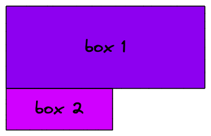
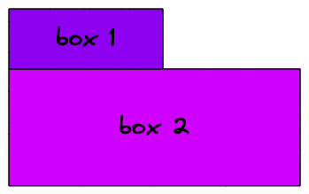

<style>
    header {
        font-size: 16px;
        font-weight: bold;
        color: #4a00e0;
    }

    footer {
        font-size: 16px;
    }

    h1, h2, h3 {
        color: #4a00e0;
    }

    h1>strong, h2>strong, h3>strong, h4>strong {
        color: #D000FF;
    }

    a {
        color: #D000FF;
    }

    section.twoColumnImage p {
        display: flex;
        justify-content: space-around;
    }

    section.titlePage footer {
        background-color: rgb(255, 255, 255, 0.8);
        color: #000;
        padding: 8px 18px;
        border-radius: 0 4px 4px 0;
        font-size: 20px;
        left: 0;
        box-shadow: 0 2px 5px 2px rgb(0, 0, 0, .4);
    }

    section.titlePage {
        color: white;
        background-image: linear-gradient(to right, #4a00e0, #D000FF );
    }

    section.titlePage h1, section.titlePage h2 {
        color: white
    }
</style>


<!--  SECTION 1: INTRO  -------------------------------->

<!-- _header: "" -->
<!-- _footer: "**Allie Polubiec**\nemail: alexandra.polubiec@gmail.com\nslides: [github.com/paloobi/intro-to-css]([github.com/paloobi](https://www.github.com/paloobi))" -->
<!-- _class: titlePage -->

# Intro to CSS

---

# What We'll Cover

* What is CSS?
* Understanding the CSS Box Model
* Basic CSS syntax
* The CSS Cascade
* After Lecture: Intro to CSS Lab

---

# How CSS Fits into the Web

<!-- JavaScript = Programming Language = Procedures & Logic, Instructions-->
* ### **JavaScript** - Programming Language

<!-- HTML = Markup Language = Content & Structure, Relationships -->
* ### **HTML** - Markup Language

<!-- CSS = Style Sheet Language = Presentation -->
* ### **CSS** - Style Sheet language

---

<!--  SECTION 2: WHAT IS CSS  -------------------------------->

<!-- _class: titlePage -->
<!-- _header: "" -->
<!-- _footer: "" -->

# What is CSS?

---

<!-- _header: Intro to CSS > What is CSS? -->

## Cascading Style Sheets

---

<!-- _header: Intro to CSS > What is CSS? -->

## **Cascading** Style Sheets
<!-- CASCADING - we'll come back to this -->

---

<!-- _header: Intro to CSS > What is CSS? -->

## Cascading **Style Sheets**
<!-- Style Sheet = (like in print media) List of Styles to be applied to structured content -->

---


<!-- _header: Intro to CSS > What is CSS? -->

<!-- _class: threecolumn -->
<style>
section.threecolumn ul { columns: 3; }
</style>

<!--

HTML handles content and structure 

CSS handles how that content is presented.

For example, CSS is used in these slides to set the text size, color and weight.
-->

# CSS = Presentation

- typography
- color
- sizing
- spacing
- layout
- animation

---
<!-- _header: "" -->
<!-- _footer: "" -->


<!-- XKCD comic -->

---
<!-- _header: "" -->
<!-- _footer: "" -->


<!-- XKCD comic without CSS -->

---

<!--  SECTION 3: BOX MODEL  -------------------------------->

<!-- _class: titlePage -->
<!-- _header: "" -->
<!-- _footer: "" -->

# The Box Model

---
<!-- _header: Intro to CSS > Box Model -->
<!-- _footer: "source: http://info.cern.ch/hypertext/WWW/MarkUp/Connolly/MarkUp.html" -->


---
<!-- _header: Intro to CSS > Box Model -->
<!-- _footer: "source: http://info.cern.ch/hypertext/WWW/MarkUp/Connolly/MarkUp.html" -->

<!-- Every HTML Element in CSS has an invisible box around it. -->


---
<!-- _header: Intro to CSS > Box Model -->

<!-- Two general display types: -->
# Box Display Types

* ### **block**
* ### **inline**

---
<!-- _header: Intro to CSS > Box Model -->

<!-- BLOCK = new block will go to the next line -->

### **Block** Elements
examples: `div`, `p`, `h1`


---
<!-- _header: Intro to CSS > Box Model -->

<!-- INLINE = new block will continue without moving to new line -->

### **Inline** Elements
examples:`a`, `span`


---
<!-- _header: Intro to CSS > Box Model -->
<!-- _class: textRight -->

<style>
    section.textRight ul {
        position: absolute;
        left: 50%;
        top: 300px;
    }
</style>

<!-- CONTENT = the dynamic content, such as the text in a paragraph, or the label on a button -->
<!-- PADDING = space between the content and its border; space inside -->
<!-- BORDER = border around the outside of the object -->
<!-- MARGIN = space around / between -->
# The Box Model

Anatomy of a Block Box in CSS


* Content
* Padding
* Border
* Margin

---
<!-- _header: Intro to CSS > Box Model -->
<!-- _class: twoColumnImage -->

# Example


---
<!-- _header: Intro to CSS > Box Model -->
<!-- _class: twoColumnImage -->

# Content


---
<!-- _header: Intro to CSS > Box Model -->
<!-- _class: twoColumnImage -->

# Padding




---
<!-- _header: Intro to CSS > Box Model -->
<!-- _class: twoColumnImage -->

# Border


---
<!-- _header: Intro to CSS > Box Model -->
<!-- _class: twoColumnImage -->

# Margin


---
<!-- _header: Intro to CSS > Box Model -->


---

<!--  SECTION 4: WRITING CSS  -------------------------------->

<!-- _class: titlePage -->
<!-- _header: "" -->
<!-- _footer: "" -->

# Writing CSS

---
<!-- _header: Intro to CSS > Writing CSS -->

# Writing CSS > Rules
**CSS Rule** = defines how a box (and its contents) should be presented

---
<!-- _header: Intro to CSS > Writing CSS > Rules -->

# Anatomy of a CSS Rule

<!-- CSS Rule - made of selector + declaration -->

```css
p { /* <---- SELECTOR */
    color: blue; /* <----- DECLARATION */
}
```

- **Selector**: which elements to apply styles to
* **Declaration**:
    * **property**: identifier to indicate what style to change
    * **value**: value to set the property

---

<!-- _header: Intro to CSS > Writing CSS > Rules -->

# Anatomy of a CSS Rule

<!-- CSS Rule - made of selector + declaration -->

```css
h1, h2 { /* <---- SELECTOR */
    color: purple; /* <------- DECLARATION */
    font-weight: bold; /* <--- DECLARATION */
}
```

* **Multiple Selectors**: comma separated
* **Multiple Declarations**: semi-colon separated

---
<!-- _header: Intro to CSS > Writing CSS > Selectors -->

# Writing CSS > Selectors

---

<!-- _header: Intro to CSS > Writing CSS > Selectors -->

## Common Selectors

* **Type** selectors - `p`, `h1`, `div`, `span`
* **Class** selectors - `.myClass`
* **ID** selectors - `#myID`

---
<!-- _header: Intro to CSS > Writing CSS > Selectors -->
<!-- _class: typeSelectors -->

<style>
    section.typeSelectors h2 {
        background-color: purple;
        color: white;
    }
</style>

## Type Selectors

Select subjects by HTML element type.

### CSS
```css
h2 {
    background-color: purple;
    color: white;
}
```
### HTML
```html
<h2>Type Selectors</h2>
```

---
<!-- _header: Intro to CSS > Writing CSS > Selectors -->
<!-- _class: classSelectors -->

<style>
    section.classSelectors h2 {
        background-color: green;
        color: white;
    }
</style>

## Class Selectors

Select subjects by their `class` attribute.

### CSS
```css
.greenText {
    background-color: green;
    color: white;
}
```

### HTML
```html
<h2 class="greenText">Class Selectors</h2>
```

---
<!-- _header: Intro to CSS > Writing CSS > Selectors -->
<!-- _class: idSelectors -->

<style>
    section.idSelectors h2 {
        background-color: darkblue;
        color: white;
    }
</style>

## ID Selectors

Select subject by its `id` attribute.

### CSS
```css
#uniqueHeader {
    color: white;
    background-color: darkblue;
}
```

### HTML
```html
<h2 id="uniqueHeader">ID Selectors</h2>
```

---
<!-- _header: Intro to CSS > Writing CSS > Selectors -->

## Advanced Selectors
* Psuedo-classes: `a:hover`
* Psuedo-elements: `p::first-line`
* Attribute selectors: `a[href]` or `a[href="example.com"]`
* Combinators
    - Lists (`h1, p`)
    - Descendent (`div p`)
    - Child (`div > p`)
    - Sibling (`h1 ~ p` and `h1 + p`)

See more in [MDN CSS Selectors Reference](https://developer.mozilla.org/en-US/docs/Web/CSS/CSS_Selectors)

---
<!-- _header: Intro to CSS > Writing CSS > Selectors -->

# CSS Syntax > Declarations

---

<!-- _header: Intro to CSS > Writing CSS > Declarations -->

# What can you do with CSS Declarations?

* Box model - margin, border, padding, content
* Text styles - `font-family`, `font-size`, `color`, `font-weight`
* Color - hex codes, RGB, `opacity`, `linear-gradient`
* Size - `height`, `width`
* Positioning & layout
* Element-specific styles - lists, tables
* Animations

---

<!-- _header: Intro to CSS > Writing CSS > Declarations -->

# How do I learn all the properties available?

* Practice _(during today's lab!)_
* Browser Developer Tools
* Read the Docs: https://developer.mozilla.org/en-US/docs/Web/CSS/Reference

---

<!--  SECTION 5: ADDING CSS TO HTML  -------------------------------->

<!-- _class: titlePage -->
<!-- _header: "" -->
<!-- _footer: "" -->

# How to Add CSS to HTML
---
<!-- _header: Intro to CSS > Adding CSS to HTML -->

## Defining an External Stylesheet

#### **./index.html**
```html
<link href="./style.css" rel="stylesheet" type="text/css"/>
<p>Hello World</p>
```

#### **./style.css**
```css
p {
    color: purple;
}
```

---
<!-- _header: Intro to CSS > Adding CSS to HTML -->

<!-- QUESTION: Why do you think it's preferable to use external style sheets? -->
# Why we use **external stylesheets**

* HTML is for content, not presentation
* Easy to find
* Keep it DRY
* Performance

---
<!--  SECTION 6: THE CASCADE  -------------------------------->

<!-- _class: titlePage -->
<!-- _header: "" -->
<!-- _footer: "" -->

# Cascade

---

<!-- _header: Intro to CSS > The Cascade -->

# What happens if there are **conflicting rules?**

---

<!-- _header: Intro to CSS > The Cascade -->

### CSS
```css
h1 {
    color: purple;
}

.header {
    color: green;
}
```

### HTML
```html
<h1 class="header">What Color Am I?</h1> 
```

---

<!-- _header: Intro to CSS > The Cascade -->

<!-- I said we'd come back to CASCADING -->
# **Cascading** Style Sheets

---
<!-- _header: Intro to CSS > The Cascade -->

<!-- CSS uses the Cascade algorithm to determine which styles to apply-->
<!-- At each stage of the Cascade, rules that apply to an element are eliminated according to various criteria until 1 remains per property -->

# The **Cascade** Algorithm

#### 1. Relevance

#### 2. Origin & Importance

#### 3. Specificity

#### 4. Order

---
<!-- _header: Intro to CSS > The Cascade -->

<!-- As a Developer, the part of this cascade that will be most directly involved in the CSS code you write are Relevance, Specificity & Order-->

<!-- RELEVANCE: Does the rule apply to this element? Selectors - already discussed -->

<!-- ORIGIN & IMPORTANCE: Where is the rule coming from? (Browser defaults? External stylesheet?) Is it flagged with the `!important` keyword? -->
<!-- I recommend spending some time reading the MDN articles on Cascade to learn more about Relevance, Importance & Origin. -->

<!-- We'll spend time on these last two: -->

<!-- SPECIFICITY: Which rule is more specific? -->
<!-- ORDER: Which rule was declared more recently? -->

# The **Cascade** Algorithm

#### 1. **Relevance**

#### 2. Origin & Importance

#### 3. **Specificity**

#### 4. **Order**

---
<!-- _header: Intro to CSS > The Cascade > Specificity -->

# The Cascade > Specificity

---
<!-- _header: Intro to CSS > The Cascade > Specificity -->

<!-- Which of the rules is most specific? -->
# More Specific > Less Specific

1. Type selector
2. Class selector
3. ID selector

---
<!-- _header: Intro to CSS > The Cascade > Specificity-->
<!-- _class: orangeHeader -->
<style>
    section.orangeHeader h1 {
        color: darkorange;
    }
</style>

<!--  QUESTION: Why is the text orange? -->

# What Color Am I?

### CSS
```css
    h1 {
        color: purple;
    }

    .header {
        color: darkorange;
    }
```

### HTML
```html
<h1 class="header">What Color Am I?</h1>
```

---

<!-- _header: Intro to CSS > The Cascade > Order -->

# The Cascade > Order

---
<!-- _header: Intro to CSS > The Cascade > Order -->
<!-- _class: redHeader -->
<style>
    section.redHeader h1 {
        color: green;
    }
</style>

<!-- Which rule was declared most recently? -->

# What Color Am I?

### CSS
```css
h1 {
    color: purple;
}

h1 {
    color: green;
}
```

### HTML
```html
<h1>What Color Am I?</h1> 
```

---
<!-- _header: Intro to CSS > The Cascade -->

# How do I know **why** something is styled the way it is?

---
<!-- _header: "" -->
<!-- _footer: "" -->

## **Browser Developer Tools**


---

<!--  SECTION 7: OUTRO  -------------------------------->


<!-- _class: titlePage -->
<!-- _header: "" -->
<!-- _footer: "" -->

# Wrapping Up

---
<!-- _header: Intro to CSS > Wrapping Up -->

# Summary

* CSS = Cascading Style Sheets
* CSS Box Model
* Writing CSS Rules
* External Stylesheets
* Cascade Algorithm - Relevance, Specificity & Order

---
<!-- _header: Intro to CSS > Wrapping Up -->

# What's Next?

* ### **Intro to CSS Lab** <--- Later Today!
* ### **CSS Layouts** - tomorrow
* ### **CSS Animations** - next week

---
<!-- _header: Intro to CSS > Wrapping Up -->

# Resources

- MDN CSS Reference: https://developer.mozilla.org/en-US/docs/Web/CSS
- MDN CSS Cascade: https://developer.mozilla.org/en-US/docs/Web/CSS/Cascade
- CSS-Tricks: https://css-tricks.com/
- _CSS is Weird_: https://hacks.mozilla.org/2019/10/why-is-css-so-weird/ (Video)
- _HTML & CSS_ by John Duckett (Book)

---

<!-- _class: titlePage -->
<!-- _header: "" -->
<!-- _footer: "**Allie Polubiec**\nemail: alexandra.polubiec@gmail.com\nslides: [github.com/paloobi/intro-to-css]([github.com/paloobi](https://www.github.com/paloobi))" -->

# Let's Get Stylin'
